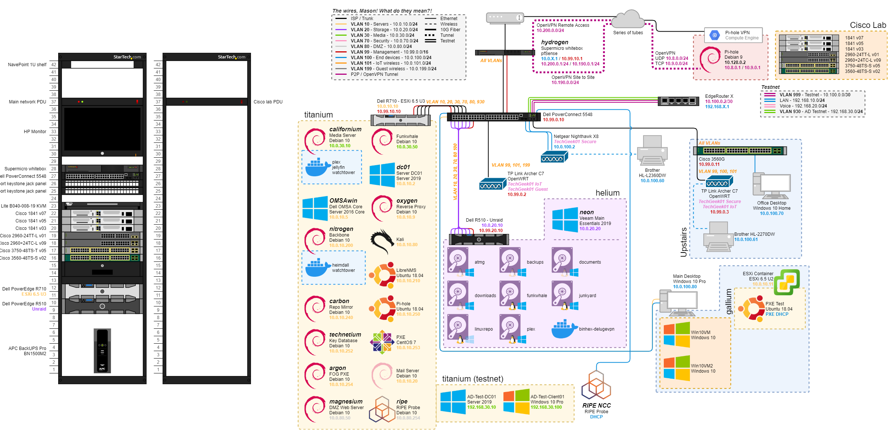
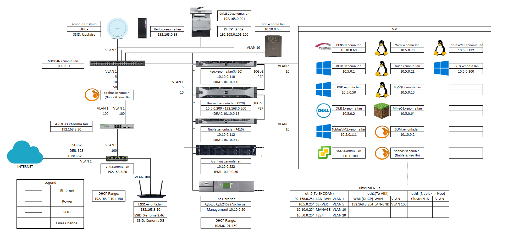
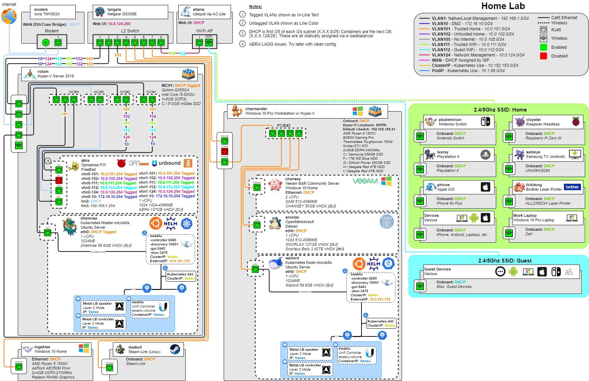

# network-diagrams

This is a collection of network diagrams I have archived from reddit:

- 
  - [/r/datahoarder](https://reddit.com/r/datahoarder)
  - [/r/homelab](https://reddit.com/r/homelab)
  - [/r/homeserver](https://reddit.com/r/homeserver)
  - [/r/selfhosted](https://reddit.com/r/selfhosted)

These diagrams are meant for reseearch and reference when building your own network diagrams

Examples:

